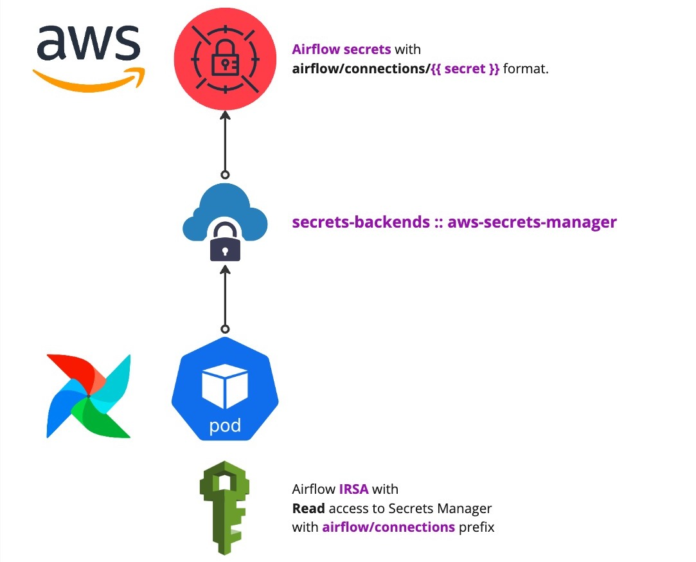
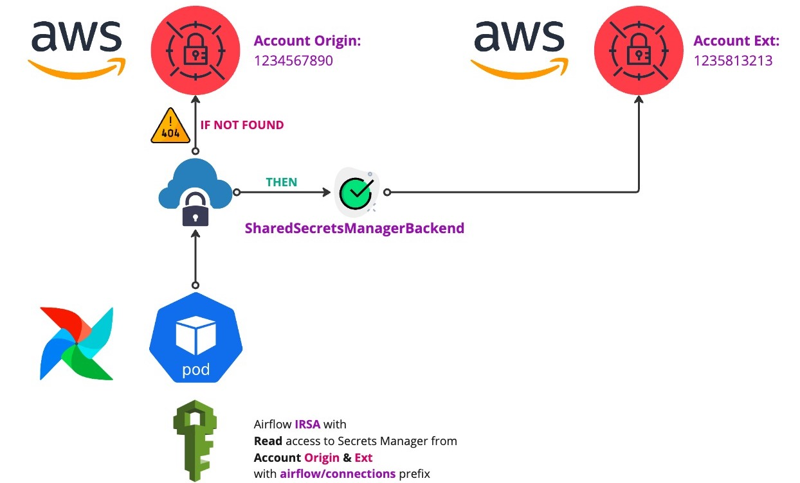

# Introduction

This guide outlines how to override the default AWS connections backend in Apache Airflow with a custom backend.
This enables Airflow to access secrets stored in other AWS accounts, in addition to the current one,
leveraging [AWS Secrets Manager](https://aws.amazon.com/es/secrets-manager/).

## Overview

By default, Airflow uses the `airflow.secrets` base class
for [secrets backends](https://airflow.apache.org/docs/apache-airflow/stable/security/secrets/secrets-backend/index.html).
To access secrets across different AWS accounts, we implemented a custom backend that extends this functionality.

<figure markdown>
  { width="500" }
  <figcaption>SecretsManagerBackend Flow</figcaption>
</figure>

!!! note "SecretsManagerBackend class"
    In short, we extended
    the [SecretsManagerBackend](https://airflow.apache.org/docs/apache-airflow-providers-amazon/stable/secrets-backends/aws-secrets-manager.html)
    class with cross-account and cross-region secrets access.

<figure markdown>
  { width="600" }
  <figcaption>SharedSecretsManagerBackend Flow</figcaption>
</figure>
